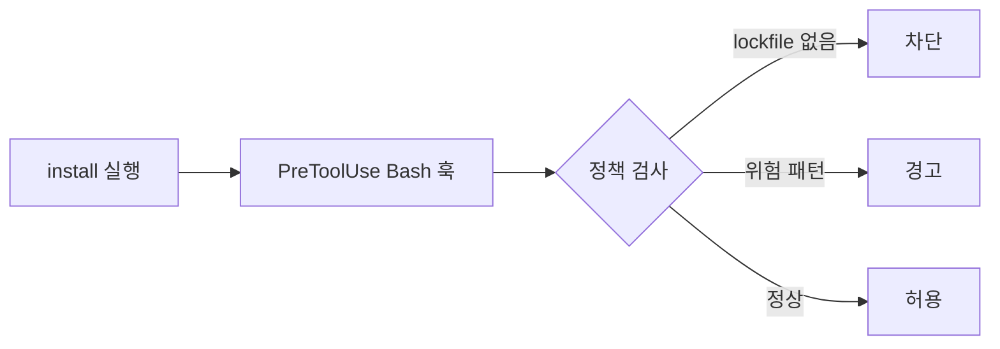
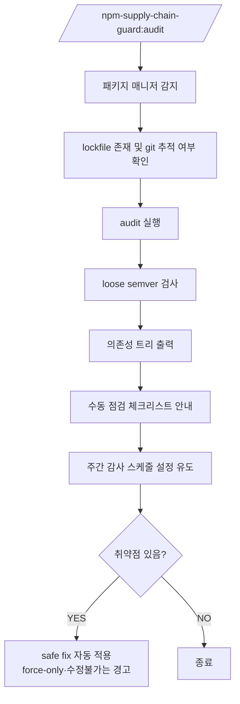

# npm-supply-chain-guard

> Claude Code에서 `npm`과 `yarn` 설치 흐름을 감시하고, 위험한 의존성 변경을 차단합니다.

`npm-supply-chain-guard`는 의존성 설치를 엄격하게 관리하기 위한 Claude Code 플러그인입니다.  
install-time 가드레일과 감사 워크플로를 통해, 공급망 공격으로 이어질 수 있는 의존성 변경을 사전에 통제합니다.


## 왜 필요한가

[npm 공급망 공격](./docs/problem-background.md)이 발생할 수 있는 다음 지점에서,

- lockfile 없이 재해석된 의존성
- 느슨한 semver 범위로 유입된 악성 버전
- `postinstall` 등 설치 lifecycle script
- 권한이 넓은 CI 또는 개발자 환경

해당 플러그인은 `install`을 **보안 민감 작업으로 간주**해, 의존성 변경을 재현 가능하고 리뷰 가능한 흐름으로 강제합니다.


## 제공 기능

- install-time 가드 훅 (`npm`, `yarn`)
- lockfile 기반 워크플로 강제
- 위험한 설치 패턴 (`--ignore-scripts` 누락 등) 경고
- `.npmrc`, `.yarnrc.yml` 보안 설정 초기화
- 의존성, semver, lockfile, 트리 감사
- 취약점 발견 시 safe fix 자동 수정 (patch/minor 범위)
- 주간 감사 스케줄링
- 커밋 시 의존성 변경 감지


## 설치

### 플러그인 마켓플레이스 (권장)

```bash
/plugin marketplace add yeonny0723/npm-supply-chain-guard
/plugin install npm-supply-chain-guard@yeonny0723
```

설치 후 사용할 수 있는 명령:

- `/npm-supply-chain-guard:init`
- `/npm-supply-chain-guard:audit`
- `/npm-supply-chain-guard:schedule`
- `/npm-supply-chain-guard:git:commit`

### 수동 설치

마켓플레이스 설치를 쓰지 않는다면 플러그인 파일을 직접 복사합니다.

```bash
cp -r hooks ~/.claude/
cp -r commands ~/.claude/
```

그리고 훅 설정을 `~/.claude/settings.json`에 병합합니다.

```json
{
  "hooks": {
    "PreToolUse": [
      {
        "matcher": "Bash",
        "hooks": [
          {
            "type": "command",
            "command": "bash ${CLAUDE_PLUGIN_ROOT}/hooks/npm/npm-install-guard.sh"
          }
        ]
      }
    ]
  }
}
```

수동 설치는 환경마다 경로 차이가 있을 수 있으므로, 실제 Claude Code 환경에서 훅 경로가 올바르게 해석되는지 확인해야 합니다.

### 첫 실행

```bash
/npm-supply-chain-guard:init
/npm-supply-chain-guard:audit
```

이 순서로 실행하면 프로젝트 기본 보안값을 먼저 적용하고, 현재 의존성 위험 상태를 바로 점검할 수 있습니다. 취약점이 발견되면 `/audit`이 safe fix(patch/minor)를 자동으로 적용합니다.

### 명령어

| Command | Primary job | Typical timing |
|---|---|---|
| `/npm-supply-chain-guard:init` | 패키지 매니저 설정 파일에 보안값을 추가 적용 | 프로젝트별 1회 또는 설정 검토 후 |
| `/npm-supply-chain-guard:audit` | 의존성 위험 상태와 워크플로 위생 점검, 안전한 취약점 자동 수정 | 수시, 배포 전, CI |
| `/npm-supply-chain-guard:schedule` | 반복 감사 스케줄 등록 | 워크스페이스 또는 팀 설정 시 1회 |
| `/npm-supply-chain-guard:git:commit` | 커밋 전에 의존성 변경 위험 노출 | 커밋 시마다 |


## 동작 방식

### 설치 명령 흐름



### 감사 명령 흐름




