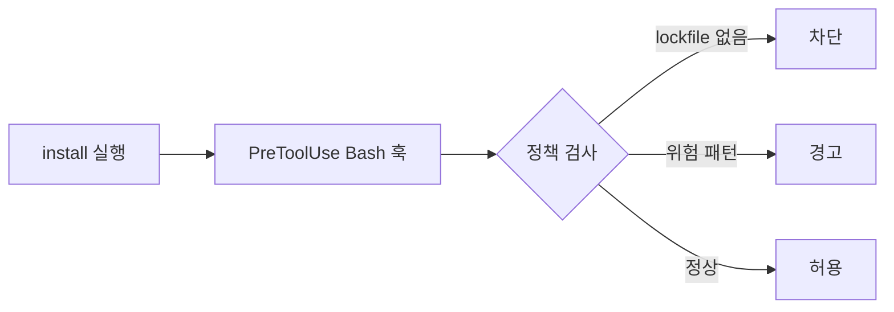
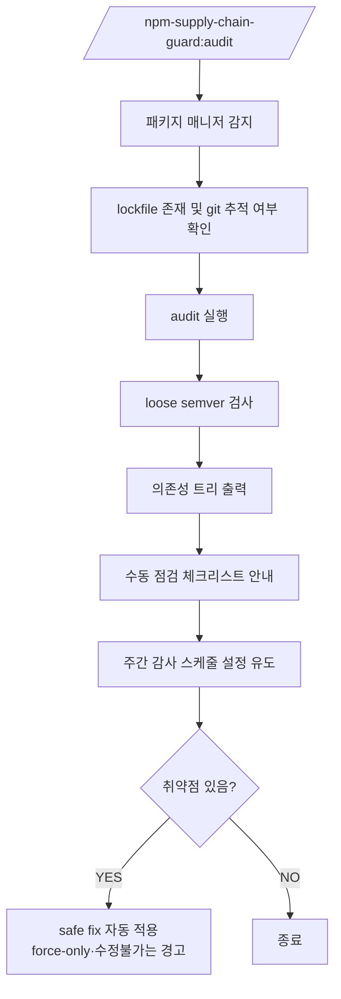

# npm-supply-chain-guard

> Claude Code에서 `npm`과 `yarn` 설치 흐름을 감시하고, 위험한 의존성 변경을 차단합니다.

`npm-supply-chain-guard`는 의존성 설치를 엄격하게 관리하기 위한 Claude Code 플러그인입니다.  
install-time 가드레일과 감사 워크플로를 통해, 공급망 공격으로 이어질 수 있는 의존성 변경을 사전에 통제합니다.


## 왜 필요한가

[npm 공급망 공격](./docs/problem-background.md)이 발생할 수 있는 다음 지점에서, 

- lockfile 없이 재해석된 의존성
- 느슨한 semver 범위로 유입된 악성 버전
- `postinstall` 등 설치 lifecycle script
- 권한이 넓은 CI 또는 개발자 환경

해당 플러그인은 `install`을 **보안 민감 작업으로 간주**해, 의존성 변경을 재현 가능하고 리뷰 가능한 흐름으로 강제합니다.


## 제공 기능

- install-time 가드 훅 (`npm`, `yarn`)
- lockfile 기반 워크플로 강제
- 위험한 설치 패턴 (`--ignore-scripts` 누락 등) 경고
- `.npmrc`, `.yarnrc.yml` 보안 설정 초기화
- 의존성, semver, lockfile, 트리 감사
- 취약점 발견 시 safe fix 자동 수정 (patch/minor 범위)
- 주간 감사 스케줄링
- 커밋 시 의존성 변경 감지


## 빠른 시작
[상세 설치 가이드](./docs/installation.md)
```bash
/plugin marketplace add yeonny0723/npm-supply-chain-guard
/plugin install npm-supply-chain-guard@yeonny0723

/npm-supply-chain-guard:init
/npm-supply-chain-guard:audit
```


## 동작 방식

### 설치 명령 흐름



### 감사 명령 흐름




## 명령어
[명령어 & 훅 상세](./docs/commands-and-hooks.md)

| Command | Purpose |
|---|---|
| `/npm-supply-chain-guard:init` | 보안 설정 적용 |
| `/npm-supply-chain-guard:audit` | 의존성 감사 |
| `/npm-supply-chain-guard:schedule` | 주간 감사 설정 |
| `/npm-supply-chain-guard:git:commit` | 의존성 변경 점검 |

## 패키지 매니저 지원 범위

| 패키지 매니저 | 지원 상태 | 비고 |
|---|---|---|
| `npm` | 지원 | install 경고/차단, init, audit 흐름 모두 기준 패키지 매니저 |
| `yarn` | 지원 | install 경고/차단, `.yarnrc.yml` 보안값 적용 |


## 훅 동작

| Situation | Behavior |
|---|---|
| lockfile 없음 | 차단 |
| `npm ci`에 `--ignore-scripts` 없음 | 경고 |
| `npm install`, `npm update` | 경고 후 `npm ci` 권장 |
| `yarn install` 비-immutable | 경고 |
| `yarn add` | 경고 |
| 안전한 패턴 | 통과 |
