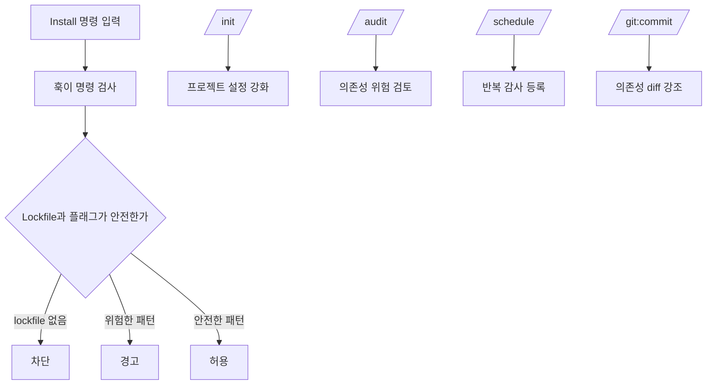

# 명령어와 훅 아키텍처

## 개요

이 플러그인은 하나의 install-time 훅과 몇 개의 목적별 명령어로 구성됩니다.

- 훅은 실행 전에 위험한 설치 흐름을 차단하거나 경고합니다.
- 명령어는 프로젝트 설정을 강화하고, 의존성 상태를 감사하고, 변경을 계속 리뷰 가능하게 유지합니다.

## 훅: `PreToolUse:Bash`

핵심 집행 지점은 `hooks/hooks.json`으로 등록된 `hooks/npm/npm-install-guard.sh`입니다.

```json
{
  "hooks": {
    "PreToolUse": [
      {
        "matcher": "Bash",
        "hooks": [
          {
            "type": "command",
            "command": "bash ${CLAUDE_PLUGIN_ROOT}/hooks/npm/npm-install-guard.sh"
          }
        ]
      }
    ]
  }
}
```

### 훅이 검사하는 것

- 현재 디렉터리에 `package.json`이 있는지
- lockfile이 존재하는지
- 명령이 `npm` 또는 `yarn` install/add 계열인지
- immutable install, ignored scripts 같은 더 안전한 패턴을 쓰는지

### 판단 결과

| Condition | Result |
|---|---|
| lockfile 없음 | 차단 |
| 위험한 install 형태 | 경고 |
| 명시적인 안전 패턴 | 허용 |
| 무관한 셸 명령 | 무시 |

## 명령어 역할

| Command | Primary job | Typical timing |
|---|---|---|
| `/npm-supply-chain-guard:init` | 패키지 매니저 설정 파일에 보안값을 추가 적용 | 프로젝트별 1회 또는 설정 검토 후 |
| `/npm-supply-chain-guard:audit` | 의존성 위험 상태와 워크플로 위생 점검 | 수시, 배포 전, CI |
| `/npm-supply-chain-guard:schedule` | 반복 감사 스케줄 등록 | 워크스페이스 또는 팀 설정 시 1회 |
| `/npm-supply-chain-guard:git:commit` | 커밋 전에 의존성 변경 위험 노출 | 커밋 시마다 |

## 상호작용 흐름



## 왜 이렇게 나눴는가

하나의 훅만으로 모든 문제를 잘 처리할 수는 없습니다.

- 훅은 실행 시점의 빠르고 단호한 개입에 적합합니다.
- 명령어는 더 무거운 점검, 설정 변경, 반복 작업 등록에 적합합니다.

이 분리는 집행 경로를 좁고 예측 가능하게 유지하면서, 감사와 프로젝트 설정은 명시적인 작업으로 남겨둡니다.

## 읽는 순서

플러그인 동작을 평가하려면 다음 순서로 보는 것이 가장 빠릅니다.

1. install 시점 판단을 맡는 훅 동작
2. 기본 보안값을 적용하는 init 명령
3. 점검 깊이를 담당하는 audit 명령
4. 변경 관리 압력을 주는 commit 명령
