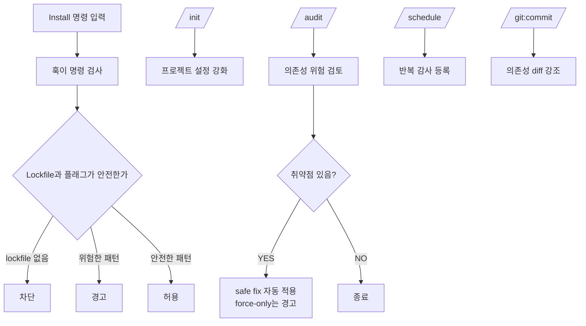
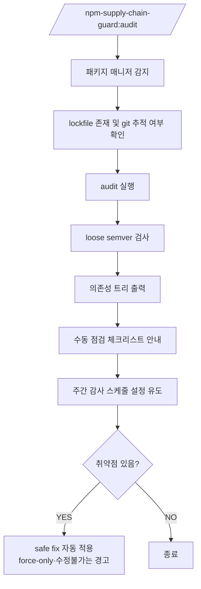

# Audit Remediation (Step 8) Implementation Plan

> **For agentic workers:** REQUIRED SUB-SKILL: Use superpowers:subagent-driven-development (recommended) or superpowers:executing-plans to implement this plan task-by-task. Steps use checkbox (`- [ ]`) syntax for tracking.

**Goal:** `/audit` 커맨드에 조건부 Step 8을 추가해 취약점 발견 시 `npm audit fix` 기반 자동 수정 흐름을 제공한다.

**Architecture:** `commands/audit.md`에 Step 8을 추가하고, allowed-tools에 `npm audit fix` 권한을 추가한다. 취약점이 0개이면 Step 8 전체를 건너뛴다. safe fix(patch/minor)만 자동 실행하고, major/force-only/수정불가는 경고만 출력한다. 관련 문서와 plugin.json 버전을 함께 갱신한다.

**Tech Stack:** Markdown (Claude Code 커맨드 파일), JSON (plugin.json)

---

## 수정 파일 목록

| 파일 | 변경 유형 | 내용 |
|------|-----------|------|
| `commands/audit.md` | 수정 | allowed-tools에 `Bash(npm audit fix:*)` 추가, Step 8 섹션 추가 |
| `docs/commands-and-hooks.md` | 수정 | Step 8 흐름 반영, 커맨드 역할 설명 업데이트 |
| `README.md` | 수정 | 감사 흐름 mermaid 다이어그램에 Step 8 노드 추가, 제공 기능에 자동 수정 항목 추가 |
| `.claude-plugin/plugin.json` | 수정 | `"version": "1.0.0"` → `"version": "1.0.1"` |

---

## Task 1: `commands/audit.md` — allowed-tools 추가

**Files:**
- Modify: `commands/audit.md` (frontmatter 섹션)

- [ ] **Step 1: `Bash(npm audit fix:*)` 를 allowed-tools에 추가**

`commands/audit.md` frontmatter를 다음으로 교체한다.

```markdown
---
description: npm 공급망 공격 방어 체크리스트 감사를 실행합니다
allowed-tools:
  - Bash(npm audit:*)
  - Bash(yarn audit:*)
  - Bash(npm ls:*)
  - Bash(yarn list:*)
  - Bash(npm audit fix:*)
  - Bash(git ls-files:*)
  - Bash(git check-ignore:*)
  - Bash(git diff:*)
  - Read
---
```

- [ ] **Step 2: 변경 확인**

`commands/audit.md` 상단에 `Bash(npm audit fix:*)` 가 추가됐는지 육안으로 확인한다.

- [ ] **Step 3: Commit**

```bash
git add commands/audit.md
git commit -m "feat(audit): add npm audit fix permission to allowed-tools"
```

---

## Task 2: `commands/audit.md` — Step 8 섹션 추가

**Files:**
- Modify: `commands/audit.md` (Step 7 이후)

- [ ] **Step 1: Step 7 끝에 Step 8 섹션 추가**

`commands/audit.md`의 Step 7 블록(주간 자동 감사 스케줄 안내) 바로 뒤에 아래 내용을 추가한다.

````markdown
### Step 8: 자동 수정 (취약점이 있을 때만)

Step 3의 audit 결과에서 취약점이 **1개 이상** 발견된 경우에만 이 단계를 실행한다. 취약점이 0개이면 Step 8 전체를 건너뛴다.

#### 8-1. yarn 프로젝트 처리

패키지 매니저가 yarn이면 `npm audit fix`를 지원하지 않으므로 아래 메시지를 출력하고 Step 8을 종료한다.

```
⚠️  yarn 프로젝트는 npm audit fix를 지원하지 않습니다.
    취약 패키지를 직접 업데이트하세요:
    yarn upgrade <패키지명>@<수정버전>
```

#### 8-2. dry-run으로 수정 범위 파악

```bash
npm audit fix --dry-run --json
```

JSON 출력을 파싱해 변경 예정 패키지 목록과 각 버전 변화를 추출한다.

#### 8-3. safe fix 분류

dry-run 결과에서 각 패키지의 변경을 아래 기준으로 분류한다.

| 분류 | 조건 | 처리 |
|------|------|------|
| **safe fix** | patch 또는 minor 버전 업 (major 불변) | 자동 실행 |
| **force-only** | major 버전 변경 또는 `--force` 필요 | 경고만 출력 |
| **수정 불가** | `fixAvailable: false` | 경고만 출력 |

#### 8-4. safe fix 자동 실행

safe fix 대상이 1개 이상이면 아래 명령을 실행한다.

```bash
npm audit fix
```

실행 후 잔여 취약점 수를 확인하기 위해 다시 감사한다.

```bash
npm audit --json
```

#### 8-5. 결과 출력

아래 형식으로 결과를 출력한다.

```
🔧 Step 8: 자동 수정

  ✅ safe fix 적용 (N개 패키지 업데이트)
     <패키지명>: <이전버전> → <수정버전>
     ...

  ⚠️  수동 조치 필요 (M개)
     <패키지명> (<severity>) — major 버전 변경 필요, 수동으로 검토하세요.
     <패키지명> (<severity>) — 패치 없음, 대체 패키지를 검토하세요.

  감사 재실행 결과: 잔여 취약점 K개
```

safe fix 대상이 없고 force-only/수정불가만 있는 경우:

```
🔧 Step 8: 자동 수정

  자동으로 수정 가능한 취약점이 없습니다.

  ⚠️  수동 조치 필요 (M개)
     <패키지명> (<severity>) — major 버전 변경 필요, 수동으로 검토하세요.
     <패키지명> (<severity>) — 패치 없음, 대체 패키지를 검토하세요.
```

> ⚠️ `npm audit fix --force` 는 breaking change를 유발할 수 있으므로 자동 실행하지 않습니다.
> safe fix 실행 시 `package-lock.json`이 변경됩니다. 변경 내용을 리뷰 후 커밋하세요.
````

- [ ] **Step 2: Commit**

```bash
git add commands/audit.md
git commit -m "feat(audit): add Step 8 conditional auto-remediation via npm audit fix"
```

---

## Task 3: `docs/commands-and-hooks.md` 업데이트

**Files:**
- Modify: `docs/commands-and-hooks.md`

- [ ] **Step 1: 커맨드 역할 표에 Step 8 반영**

`docs/commands-and-hooks.md`의 "커맨드 역할" 표에서 `/npm-supply-chain-guard:audit` 행을 찾아 아래와 같이 수정한다.

변경 전:
```markdown
| `/npm-supply-chain-guard:audit` | 의존성 위험 상태와 워크플로 위생 점검 | 수시, 배포 전, CI |
```

변경 후:
```markdown
| `/npm-supply-chain-guard:audit` | 의존성 위험 상태와 워크플로 위생 점검, 안전한 취약점 자동 수정 | 수시, 배포 전, CI |
```

- [ ] **Step 2: 감사 흐름 mermaid 다이어그램에 Step 8 추가**

`docs/commands-and-hooks.md`의 mermaid 다이어그램(flowchart TD)을 찾아 아래로 교체한다.

```markdown

```

- [ ] **Step 3: Commit**

```bash
git add docs/commands-and-hooks.md
git commit -m "docs: update commands-and-hooks to reflect Step 8 remediation flow"
```

---

## Task 4: `README.md` 업데이트

**Files:**
- Modify: `README.md`

- [ ] **Step 1: 제공 기능 목록에 자동 수정 항목 추가**

`README.md`의 "제공 기능" 목록에 아래 항목을 추가한다.

변경 전:
```markdown
- 의존성, semver, lockfile, 트리 감사
```

변경 후:
```markdown
- 의존성, semver, lockfile, 트리 감사
- 취약점 발견 시 safe fix 자동 수정 (patch/minor 범위)
```

- [ ] **Step 2: 감사 흐름 mermaid 다이어그램에 Step 8 노드 추가**

`README.md`의 "감사 명령 흐름" mermaid 블록을 아래로 교체한다.

```markdown

```

- [ ] **Step 3: Commit**

```bash
git add README.md
git commit -m "docs(readme): add Step 8 remediation to audit flow diagram and feature list"
```

---

## Task 5: `plugin.json` 버전 패치

**Files:**
- Modify: `.claude-plugin/plugin.json`

- [ ] **Step 1: 버전 1.0.0 → 1.0.1 로 변경**

`.claude-plugin/plugin.json`의 `"version"` 필드를 수정한다.

변경 전:
```json
"version": "1.0.0",
```

변경 후:
```json
"version": "1.0.1",
```

- [ ] **Step 2: Commit**

```bash
git add .claude-plugin/plugin.json
git commit -m "chore: bump version to 1.0.1 — audit Step 8 remediation"
```

---

## 셀프 리뷰

**스펙 커버리지:**
- [x] allowed-tools에 `npm audit fix` 추가 → Task 1
- [x] 취약점 없으면 Step 8 건너뜀 → Task 2 Step 8 조건부 실행 명시
- [x] safe fix 자동 실행 → Task 2 8-3, 8-4
- [x] force-only/수정불가 경고만 출력 → Task 2 8-5
- [x] yarn 수동 안내 → Task 2 8-1
- [x] `--force` 자동 실행 금지 명시 → Task 2 8-5 주의 블록
- [x] 관련 문서 업데이트 → Task 3, 4
- [x] 버전 패치 → Task 5

**Placeholder 없음:** TBD, TODO 없음

**타입 일관성:** 파일 수정만이므로 해당 없음
